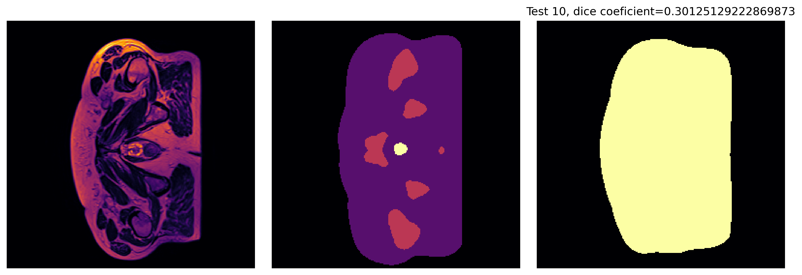
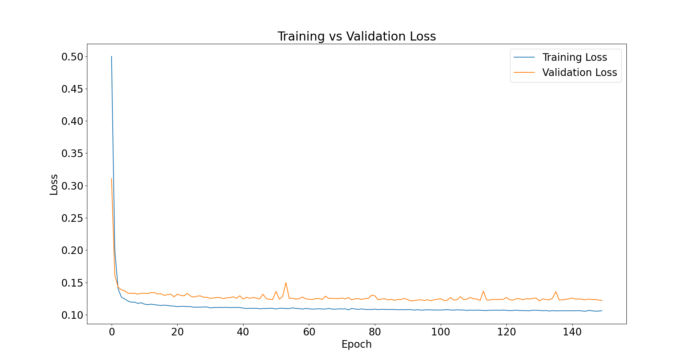

# 3d Unet For pelvis segmentation
## Algorithm
This algorithum aims to automatically annotate scans of pelvises to segment features for later processing. This will be acived by implimenting a unet based on [1] which can be seen below. 


This basic strucure was modified due to the data set being used having fewer input channels and a larger resolution. The final structure of the implimented unet can be seen below
\
where:\
(->): convolution layers with BN, Leaky Relu and dropout\
(->): last one is just regular convolution
(==>): skip connections\
(\/): Max Pooling\
(^): upsampling\
(n): numer of channels

### reproducing results
To reproduce similar results, you will need to have a machine to train this model and the data to train it. The data can either be retireved on the uq gpu cluster or from [2]. After that there is some preporcessing that the user must compleate. That is documented in the Data section of this readme. Other than that a python environment with all the various dependancies is required.

After the setup is compleated train.py can be run to train a model and predict.py can be run to test the model and print out various statisticts

## Results
The results of the training of the algorithm were unfortunately unsuccessfull. This is because of a faulty loss function that seemed to indicate that the model was successfully training. This fault was only discovered when visualisations of the results were being created, without time to train new models fully, or test variations on hyper perameters. Below can be seen the resutls of training a model with an experimental dice-ce loss only trained for xxxxxxxxxxxxxxxx epochs, with an average test dice coeficient of xxxxxxxxxxxxx, far from the expectation.



From this it can be seen that the has been able to compleate basic segmentation of the major background and tissue areas, however it lacks the ability to properly segment 4 of the classes. It is unknown whether the model needed more time to train or whether the experemental loss function is inapropriate, more testing would be necesarry.

Below can be seen the loss-validations curves of the model that was trained to find these images



## Dependancies
The packages used to run this code are as follows,
- torch 2.8.0+cu126
- torchvision 0.23.0+cu126
- torchmetrics 1.8.2
- numpy 2.3.3
- nibabel 5.3.2
- tdqm 4.67.1
- scikit-learn 1.7.2
- matplotlib 3.10.7\ 
Difering versions could be especially versions >= version used. Additionally these packages themselves have dependencies.

## Data
There was minimal preprocessing of the data the main preprocessing was normalising the scan images and one hot encoding of the label images. The original format of the scan annotatins was\
5: prostate\
4: anal cavity\
3: bladder\
2: bone\
1: miscilanious tissue\
0: background\
So this data was one-hot encoded for the final algorithum.

The train-test-valitation split was 80% training and validation with 20% testing, with a further 90%-10% training-validation split, so a 72-8-20 train-validation-test split. This was chosen to maximise the ammount of trainign data, as the dataset has relitively few samples.

Another noteable action of preprocessing was the removal of case 19, this was done because of a data resolution mismatch, and given that it was the only case with this issue it was chosen to remove it rather than resize it. To reproduce the results this traning it should be removed. In the case that data is being downloaded from [2] then the command below should be run in the PatternAnalysis-2025/recognition/3d_unet_prostate_segmentation_47447600/data/ directory
```sh
rm  semantic_MRs_anon/Case_019* semantic_labels_anon/Case_019*
```
If the data on rangpur is being used it is recomended to copy the data into the project files and then remove case 19, the commands for that are below again to be run from the PatternAnalysis-2025/recognition/3d_unet_prostate_segmentation_47447600/data/ directory
```sh
cp -r /home/groups/comp3710/HipMRI_study_open/semantic_MRs /home/groups/comp3710/HipMRI_study_open/semantic_labels_only .
rm semantic_MRs/K019* semantic_labels_only/K019*
```

## References
1. O. Cicek, A. Abdulkadir, S. S. Lienkamp, T. Brox, and O. Ronneberger, “3D U-Net: Learning Dense Volumetric Segmentation from Sparse Annotation,” in Medical Image Computing and Computer-Assisted Intervention – MICCAI 2016, ser. Lecture Notes in Computer Science, S. Ourselin, L. Joskowicz, M. R. Sabuncu, G. Unal, and W. Wells, Eds. Cham: Springer International Publishing, 2016, pp. 424–432.
2. J. Dowling, P. Greer, “Labelled weekly MR images of the male pelvis ,” Csiro.au, 2025. https://data.csiro.au/collection/csiro:51392v2?redirected=true
